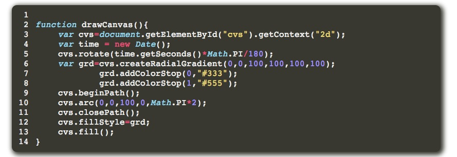
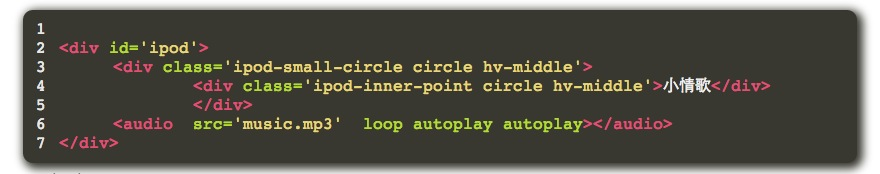
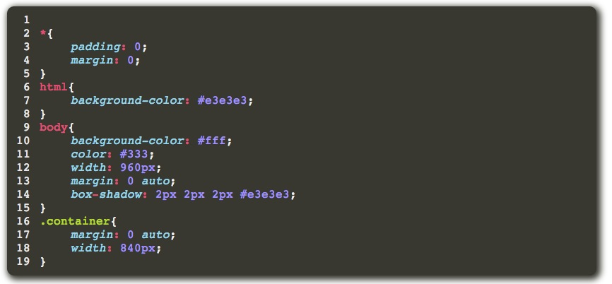

jekyll-monokai
==============

jekyll highlight plug with self-use monokai

用了一会儿时间做了下这个`monokai for jekyll(or pygments)`
使用方法：

        将代码中的`monokai.css`加入到你的jekyll的css代码中即可

效果如下：
### js测试：

### html测试：

### css测试:

